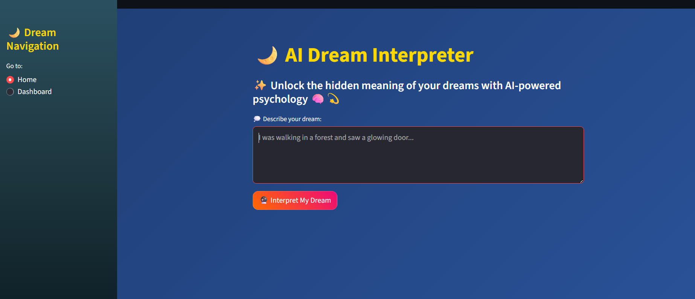
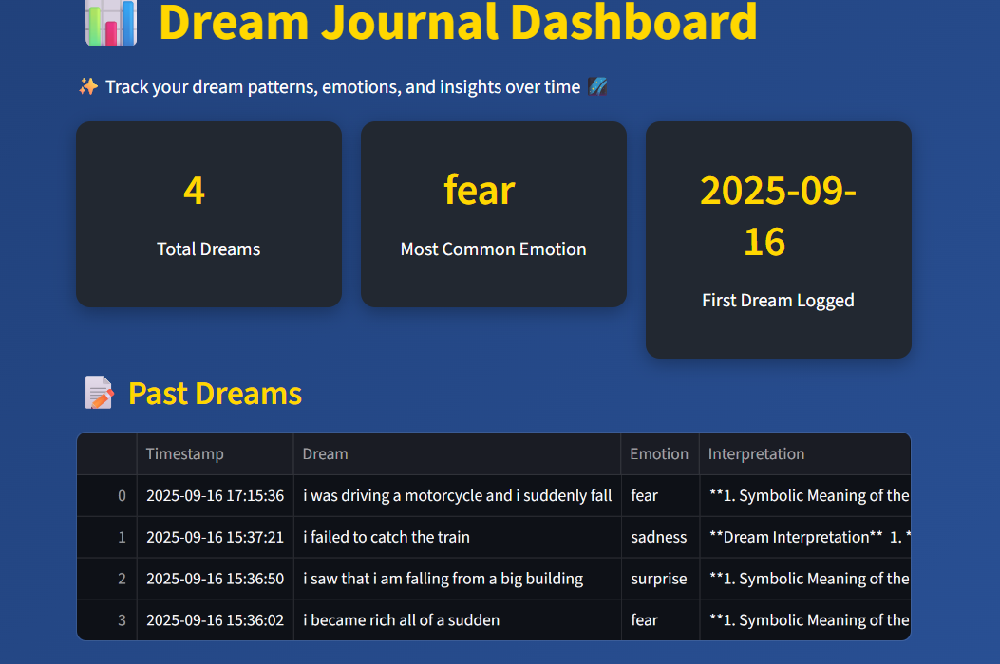
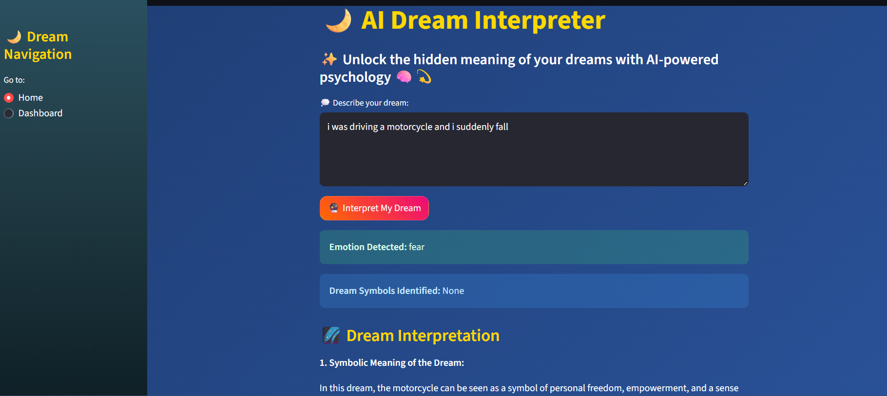

# 🌙 AI Dream Interpreter

An **AI-powered Dream Interpretation System** that blends **psychology + AI + emotional analysis** to give deeper insights into your subconscious mind.  
Built with **Streamlit**, **NLP**, and **LLM-based reasoning** (LLaMA via Hugging Face).

---

## ✨ Features

- 🧠 **Dream Interpretation**: Extracts psychological symbols and connects them with real-life emotions.  
- 😃 **Emotion Tracking**: Sentiment analysis of user’s mood logs.  
- 📚 **RAG + Psychology DB**: Uses retrieval-augmented generation for accurate psychological insights.  
- 📊 **Dashboard**: Interactive and colorful charts showing dream trends, recurring themes, and mood correlation.  
- 🎨 **Modern UI**: Beautiful, intuitive, and interview-ready.

---

## 🖼️ Screenshots

### 🌙 Home Page
Describe your dream and get an instant interpretation.



---

### 📊 Dashboard
Visualize dream patterns, recurring symbols, and mood tracking.



---

### 🔮 Insights
See how dreams and emotions connect over time.



---

## 🛠️ Tech Stack

- **Frontend/UI** → Streamlit  
- **NLP & NER** → Hugging Face Transformers  
- **LLM Reasoning** → LLaMA 3.1 (Hugging Face API)  
- **Database** → SQLite (dream + mood logs)  
- **Visualization** → Matplotlib & Streamlit native charts  

---

## 🚀 Getting Started

### 1. Clone the Repository
```bash
git clone https://github.com/PratyayRajak/AI_Dream_Interpreter.git
cd AI_Dream_Interpreter
